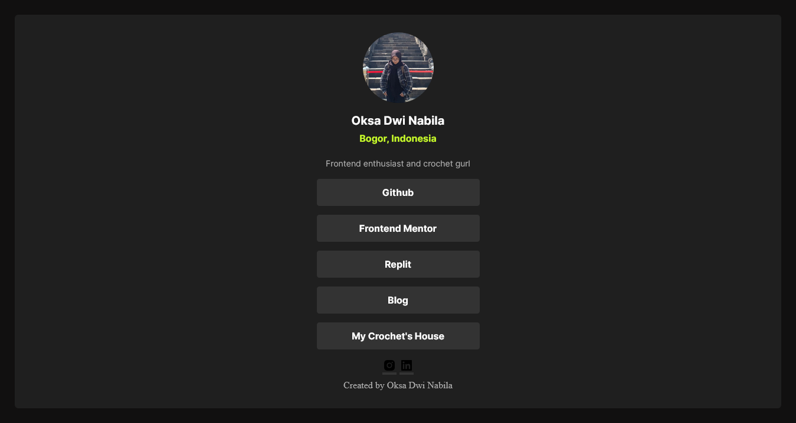

# Frontend Mentor - Social links profile solution

This is a solution to the [Social links profile challenge on Frontend Mentor](https://www.frontendmentor.io/challenges/social-links-profile-UG32l9m6dQ). Frontend Mentor challenges help you improve your coding skills by building realistic projects. 

## Table of contents

- [Overview](#overview)
  - [The challenge](#the-challenge)
  - [Screenshot](#screenshot)
  - [Links](#links)
- [My process](#my-process)
  - [Built with](#built-with)
  - [What I learned](#what-i-learned)
  - [Continued development](#continued-development)
  - [Useful resources](#useful-resources)
- [Author](#author)
- [Acknowledgments](#acknowledgments)

**Note: Delete this note and update the table of contents based on what sections you keep.**

## Overview

### The challenge

Users should be able to:

- See hover and focus states for all interactive elements on the page

### Screenshot

### Links

- Solution URL: [The Solution for this Challenge ]([https://your-solution-url.com](https://github.com/Oksadeebila/oks-profile.git))
- Live Site URL: [Add live site URL here](https://your-live-site-url.com)

## My process

### Built with

- Semantic HTML5 markup
- CSS custom properties
- Flexbox
- Mobile-first workflow

### What I learned

From this challenge, i learn about how to make the button look more interactive when we put cursor on them. I actually struggle a lot in how to make them fit on every devices as much as possible, i think i did it well for now on. To write this with clean code is hard, but i improve a lot from my lastest project. I am having fun making this challenge. 

### Continued development

-using root for the shortcut to color 
-improve the abilities to put content in the right place, either it is grid, flex or others 
-start to write codes in mobile mode first 

## Author

- Website - [Oksa Dwi Nabila](https://www.your-site.com)
- Frontend Mentor - [@Oksadeebilae](https://www.frontendmentor.io/profile/Oksadeebila)
- Twitter - [@oksadeebila](https://www.twitter.com/oksadeebila)
